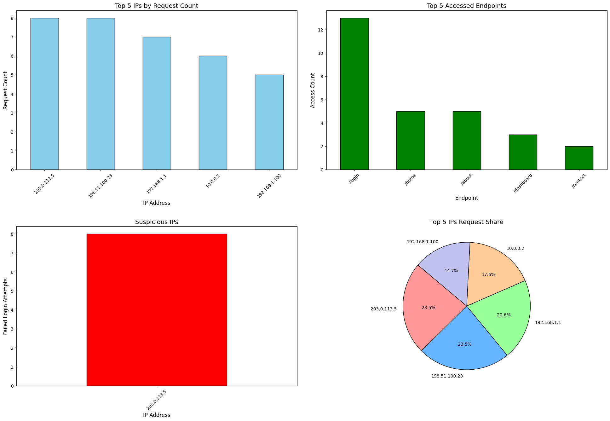

# Server Log Analysis

 
 
 


This project analyzes server log files to extract insights, detect suspicious activities, and visualize server usage patterns through an interactive dashboard.

## Features

- 📋 **Log Parsing**:  
  Extracts IP addresses, timestamps, HTTP methods, endpoints, and status codes from log files.  
  Organizes data into a pandas DataFrame for easy processing.
  
- 📊 **Analysis**:  
  - **Requests per IP**: Counts the number of requests from each IP address.  
  - **Most Accessed Endpoint**: Identifies the endpoint with the highest number of hits.  
  - **Suspicious Activity Detection**: Flags IPs with failed login attempts (`401` status code) exceeding a defined threshold.

- 🗂️ **Results**:  
  Outputs analysis in a well-structured CSV file with three sections:  
  - Requests per IP  
  - Most Accessed Endpoints  
  - Suspicious Activity

- 📈 **Visualization Dashboard**:  
  A unified dashboard with:  
  - Bar chart of the top 5 IPs by request count.  
  - Bar chart of the most accessed endpoints.  
  - Bar chart of suspicious IPs (if detected).  
  - Pie chart of the request distribution for the top 5 IPs.


## Installation

### 🔧 Prerequisites
- Python 3.8 or higher  
- Required libraries:
  - `pandas`
  - `matplotlib`

### 🚀 Install Dependencies
Run the following command:
```bash
pip install pandas matplotlib
```

## Usage

### 📝 Prepare Your Log File
Save the server log file as `sample.log` in the same directory as the script.

### 🚀 Run the Script
```bash
python log_analysis.py
```

### 📥 View Results
- Results will be displayed in the terminal.
- A CSV file named `log_analysis_results.csv` will be generated.
- The interactive visualization dashboard will pop up.

## CSV File Structure

The output CSV file is organized into three sections:

### 1️⃣ **Requests per IP**:
| IP Address     | Request Count |
|----------------|---------------|
| 192.168.0.1    | 25            |
| 192.168.0.2    | 12            |

---

### 2️⃣ **Most Accessed Endpoint**:
| Endpoint       | Access Count |
|----------------|--------------|
| /endpoint1     | 45           |
| /endpoint2     | 30           |

---

### 3️⃣ **Suspicious Activity**:
| IP Address     | Failed Login Count |
|----------------|--------------------|
| 192.168.0.3    | 7                  |

## Visualizations

The dashboard includes:
1. 📊 **Bar Chart**: Top 5 IPs by request count.
2. 📊 **Bar Chart**: Top accessed endpoints.
3. 🔴 **Bar Chart**: Suspicious IPs with failed login attempts (if any).
4. 📊 **Pie Chart**: Request distribution among the top 5 IPs.



## Example Log Format

The log file should follow this format:
```
192.168.0.1 - - [01/Dec/2024:12:45:30 +0000] "GET /endpoint1 HTTP/1.1" 200
192.168.0.2 - - [01/Dec/2024:12:45:31 +0000] "POST /endpoint2 HTTP/1.1" 401
```

## Customization

- 🔄 **Log Format**: Modify the regex pattern in the script to match your log file format.
- 🚨 **Suspicious Activity Threshold**: Update the threshold in the function `detect_suspicious_activity()` as needed.


## Acknowledgments

- **pandas** for data analysis.  
- **matplotlib** for visualization.

